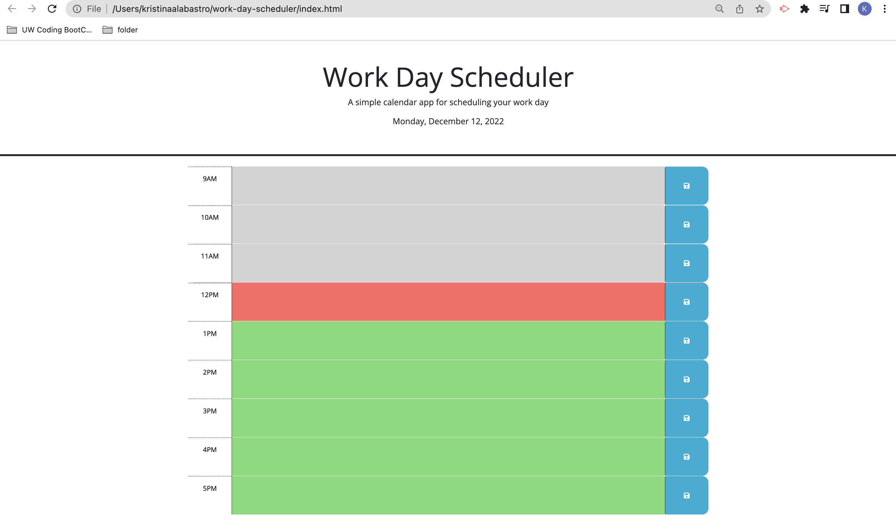

# Work Day Essential Scheduler App

## Description
This calendar planner application can help the user stay organized during the standard business hours 9am-5pm. Tasks can be added to each time block and has the funtionality to update the current date using the refresh button.

## Installation
N/A

## Usage 
To use, find specified hour time block and click into the textbox. Write the task that you would like to accomplish. The text boxs represent the different time periods. Grey for past, red for present, and green for future. After the desired task is written in the textbox, the text can be saved to the local storage and appear in the textbox for future reference.

### Screenshot to Webpage 

### Link to Deloyed Website 
https://kristinaa7.github.io/work-day-scheduler/

## Credits 
https://cdn.jsdelivr.net/npm/bootstrap@5.1.3/dist/css/bootstrap.min.css

https://use.fontawesome.com/releases/v5.8.1/css/all.css

https://fonts.googleapis.com/css?family=Open+Sans&display=swap 
